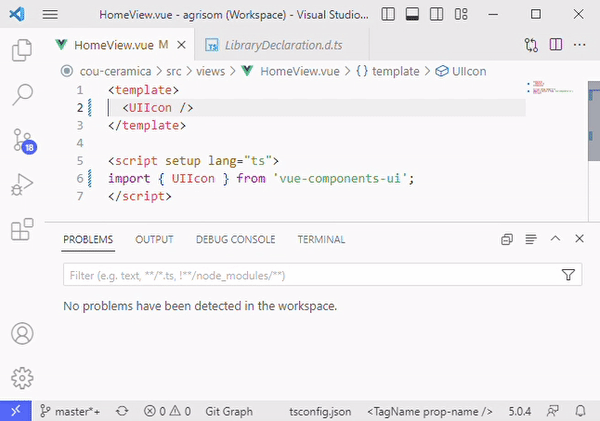

<a href="https://github.com/agrisom" title="agrisom" target="_blank">
  
</a>

<br>

<a href="https://www.npmjs.com/package/vue-components-ui" title="Total Downloads">
  
</a> 
<a href="https://www.npmjs.com/package/vue-components-ui?activeTab=versions" title="Latest Release">
  
</a> 
<a href="https://github.com/agrisom/vue-components-ui/blob/master/LICENSE" title="License">
  
</a>

# Welcome to Vue Components UI

Welcome to **Vue Components UI** – The ultimate library of customizable components designed to elevate your Vue projects to the next level!

This library contains everything you need to create an amazing Vue project in no time. All of the components are built using the latest technologies including Vue 3 (Script setup), Typescript, HTML and SCSS, making them the most consistent and reliable components available. With type checking, our components are designed to catch errors, save time and improve the quality of your code. Also the rollup offers optimizations like tree shaking to remove any component that hasn't been used.
All components are fully customizable and use props and slots to personalize every detail, while CSS variables help create unique styles that match your project's needs. 

With Typescript, you can use extensions such as Volar and ESLint to autocomplete props, check errors, and more.

> This library is currently under construction, but we'll be releasing new components as soon as they're tested and ready for use.

## How it works

- [x] Build tool [Vite](https://vitejs.dev/)
- [x] Framework [Vue 3](https://vuejs.org/)
- [x] Type system [TypeScript](https://www.typescriptlang.org/) / [Vue tsc](https://github.com/vuejs/language-tools)
- [x] Build plugin [typescript2](https://github.com/ezolenko/rollup-plugin-typescript2)
- [x] Vue script setup [SFC](https://vuejs.org/api/sfc-script-setup.html)
- [x] Router [Vue router](https://router.vuejs.org/)
- [x] Styling [SCSS](https://sass-lang.com/)
- [x] Publish repository [npm](https://www.npmjs.com/package/vue-components-ui)
- [x] Documentation [storybook](https://storybook.js.org/)

## Collaborators

<a href="https://github.com/agrisom" title="agrisom">
  
</a>
<br>
<a href="https://es.linkedin.com/in/albert-griso-mendez" target="_blank">
  
</a>

## Installation

This library is published to the [npm repository](https://www.npmjs.com/package/vue-components-ui), making the installation process a breeze. Simply add this dependency, import styles and start developing.

### Dependency: npm

Install the latest version:

`npm install --save-dev vue-components-ui`

Or import an especific version:

`npm install --save-dev vue-components-ui#0.1.4`

### Import styles

After installing the dependency, import the CSS file to your main Vue instance or HTML head to use the library's styles.
Customize the look and feel of the components by rewriting the CSS variables to match your project's needs.

**main.ts**

```ts
import 'vue-components-ui/style.css';
```

## Usage

After completing the installation steps we are ready to use the components.
For this, import them individually on demand. This approach ensures that components are loaded only when needed, minimizing the time it takes to load your page. In addition, Vue and Vite's tree-shaking feature will automatically exclude unused components from the final build.

### Usage example

**Page.vue**

```html
<script setup lang="ts">
import { MyComponent } from 'vue-components-ui';
</script>

<template>
  <MyComponent text="My Header" color="green"/>
</template>
```

### Error checking and autocomplete

Using Typescript will not only make implementation easier, but also faster and more efficient, resulting in higher-quality code.
With extensions like Volar and ESLint, developers can easily manage props, catch errors, and even auto-complete code, making the development process more streamlined and efficient.



## Repository

All the code is public on GitHub, so you can review, learn, and even improve it for your specific needs.

Check out the code on github, [agrisom/vue-components-ui](https://github.com/agrisom/vue-components-ui)

## Documentation

Our **Vue Components UI library** is fully documented and testable with Storybook, a user interface development environment for testing and showcasing interactive components. We've published a version of Storybook on Netlify, where you can access documentation for each component, as well as a playground and testing tools. This way, you can easily see how each component works, test it out for yourself, and integrate it into your Vue projects with confidence.

All components are testable and documented with storybook.

A version of storybook is publish via netlify. There you will found documentation for every component along with a playground and testing tools

[Vue Components UI - Documentation](https://vue-components-ui.netlify.app)